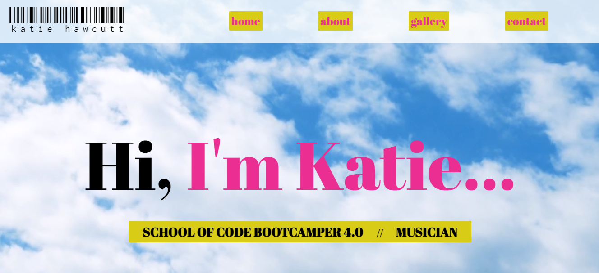
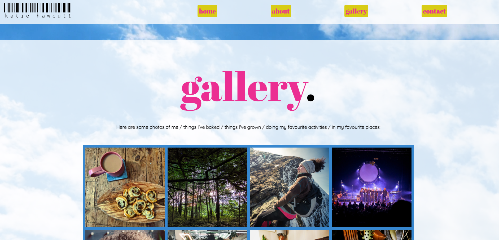

# Hi, I'm Katie webpage

###### September 2020

_This was my first School of Code assignment and we were given it just before the bootcamp started as part the pre-course homework. We had to create a webpage about ourselves using only HTML and CSS._

### Main Learning Points:

- I used a video as the background image for the first time and really liked how it turned out
- I made sure to use semantic HTML elements
- I used CSS variables for the color scheme
- I used CSS Grid for the photo gallery and Flexbox for the rest of the layout
- I spent quite a bit of time on the design and I really like the outcome
